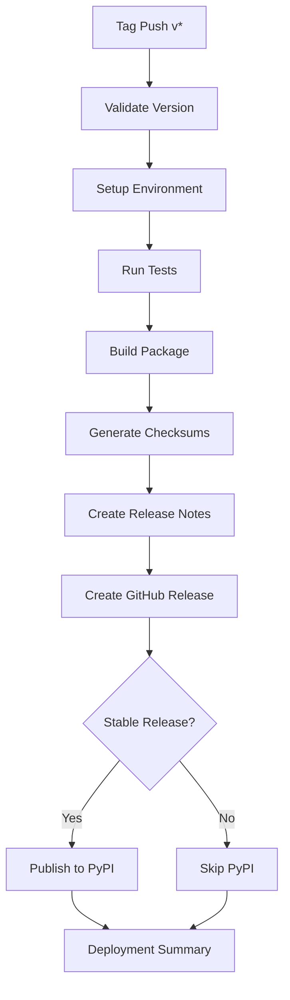

# Release Guide

This guide explains how to create releases for the VDS Xarray Backend project.

## 🚀 Quick Release (Recommended)

Use the release helper script for the easiest release process:

```bash
./scripts/release.sh
```

This script will:
1. ✅ Check prerequisites (git, uv, clean working directory)
2. 🔢 Prompt for new version number
3. 📝 Update version in all relevant files
4. 🧪 Run the full test suite
5. 📦 Build and validate the package
6. 🏷️ Create and push git tag
7. 🚀 Trigger automated GitHub Actions release

## 📋 Release Types

### Stable Release (vX.Y.Z)
- **Triggered by:** Tags matching `v*.*.*` (e.g., `v1.0.0`, `v1.2.3`)
- **Actions:**
  - Creates GitHub release with changelog
  - Builds wheel and source distribution
  - Publishes to PyPI automatically
  - Generates checksums and signatures

### Pre-release (vX.Y.Z-suffix)
- **Triggered by:** Tags with suffixes (e.g., `v1.0.0-beta.1`, `v1.2.0-rc.1`)
- **Actions:**
  - Creates GitHub release marked as pre-release
  - Builds and attaches wheel files
  - Does NOT publish to PyPI automatically
  - Manual PyPI publish available via workflow dispatch

## 🔄 Automated Workflows

### 1. Release Workflow (`.github/workflows/release.yml`)
**Triggered by:** Pushing version tags (`v*`)

**Process:**


### 2. Manual Release Workflow (`.github/workflows/manual-release.yml`)
**Triggered by:** Manual workflow dispatch

**Features:**
- Update version in files automatically
- Create draft or published releases
- Mark as pre-release option
- Choose PyPI publication

## 📝 Manual Release Process

If you prefer manual control:

### 1. Update Version
Update version in these files:
- `pyproject.toml`: `version = "1.0.0"`
- `vdsxarray/__init__.py`: `__version__ = "1.0.0"`

### 2. Run Quality Checks
```bash
# Install dependencies
uv sync --group dev --group test

# Run tests
uv run pytest

# Run linters
uv run ruff check .
uv run black --check .
uv run isort --check-only .

# Build package
uv run python -m build

# Validate package
uv run twine check dist/*
```

### 3. Create and Push Tag
```bash
# Commit version changes
git add pyproject.toml vdsxarray/__init__.py
git commit -m "Bump version to 1.0.0"

# Create tag
git tag -a v1.0.0 -m "Release 1.0.0"

# Push
git push origin main
git push origin v1.0.0
```

### 4. Monitor Release
- **Actions:** https://github.com/your-org/vds-xarray-backend/actions
- **Releases:** https://github.com/your-org/vds-xarray-backend/releases
- **PyPI:** https://pypi.org/project/vdsxarray/

## 🔧 Release Configuration

### Version Format
Follow [Semantic Versioning](https://semver.org/):
- **Major:** Breaking changes (`1.0.0` → `2.0.0`)
- **Minor:** New features (`1.0.0` → `1.1.0`)  
- **Patch:** Bug fixes (`1.0.0` → `1.0.1`)
- **Pre-release:** Add suffix (`1.0.0-beta.1`, `1.0.0-rc.1`)

### PyPI Publishing Rules
- **Stable releases** (`v1.0.0`): Auto-publish to PyPI
- **Pre-releases** (`v1.0.0-beta.1`): Manual PyPI publish only
- **Requires:** `PYPI_API_TOKEN` secret in repository settings

### GitHub Release Notes
Auto-generated from:
- Git commit messages since last release
- Pull request titles and descriptions
- Contributor information
- Package metadata and checksums

## 🛠️ Troubleshooting

### Common Issues

**❌ Version validation failed**
- Ensure version follows semantic versioning
- Check that new version is different from current

**❌ Tests failed**
- Fix failing tests before releasing
- All tests must pass for successful release

**❌ PyPI publish failed**
- Check `PYPI_API_TOKEN` secret is configured
- Verify package name availability
- Ensure version doesn't already exist

**❌ Tag already exists**
- Delete existing tag: `git tag -d v1.0.0 && git push origin :refs/tags/v1.0.0`
- Use a different version number

### Getting Help

1. **Check workflow logs** in GitHub Actions
2. **Review release checklist** in this guide
3. **Validate package locally** before tagging
4. **Test with TestPyPI** first if unsure

## ✅ Release Checklist

Before creating a release:

- [ ] All tests pass locally
- [ ] Documentation is up to date
- [ ] CHANGELOG.md updated (if exists)
- [ ] Version follows semantic versioning
- [ ] No uncommitted changes
- [ ] On main/master branch
- [ ] PyPI token configured (for stable releases)
- [ ] GitHub release permissions configured

## 🎯 Best Practices

1. **Test thoroughly** before releasing
2. **Use semantic versioning** consistently
3. **Write clear commit messages** (they become release notes)
4. **Review package contents** before publishing
5. **Monitor release process** in GitHub Actions
6. **Announce releases** to relevant channels
7. **Keep dependencies updated** in releases

---

For questions about releases, check the GitHub Actions logs or create an issue.
